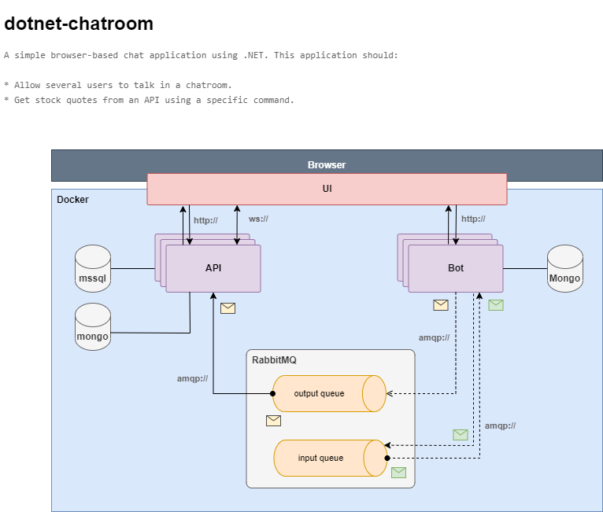
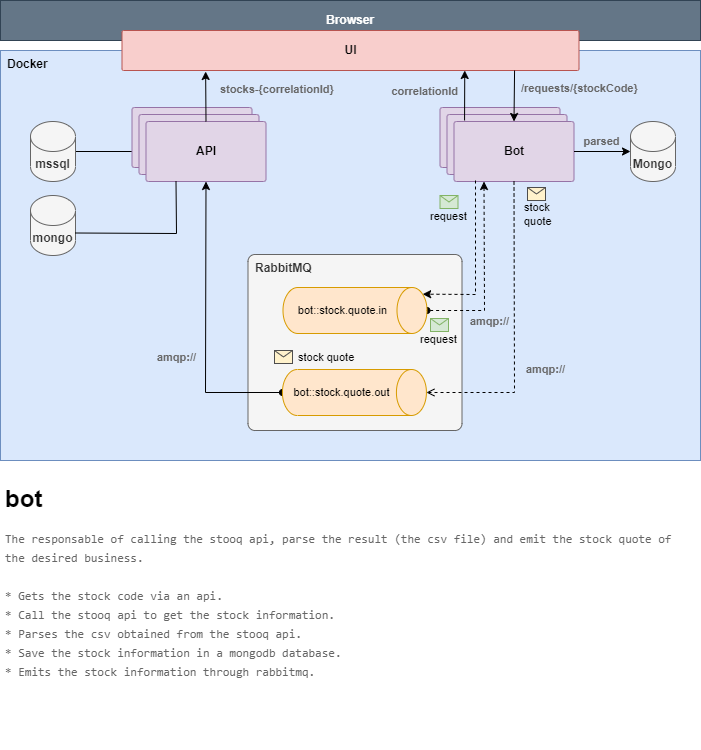
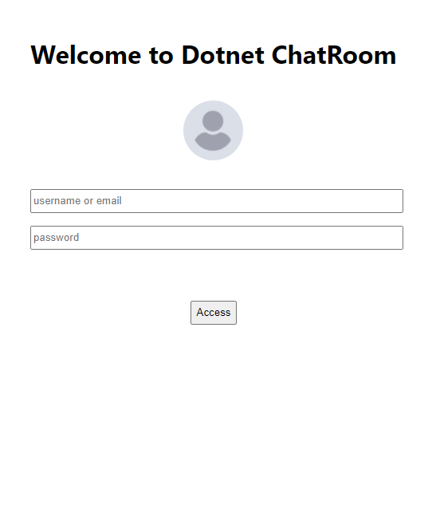
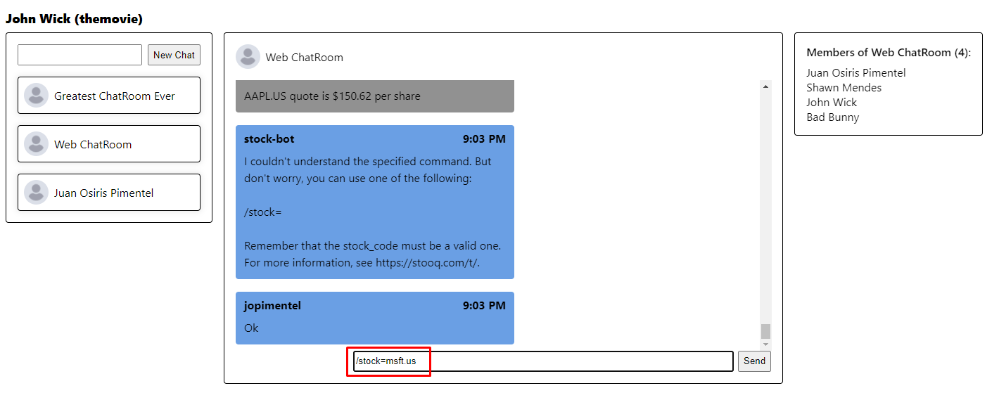
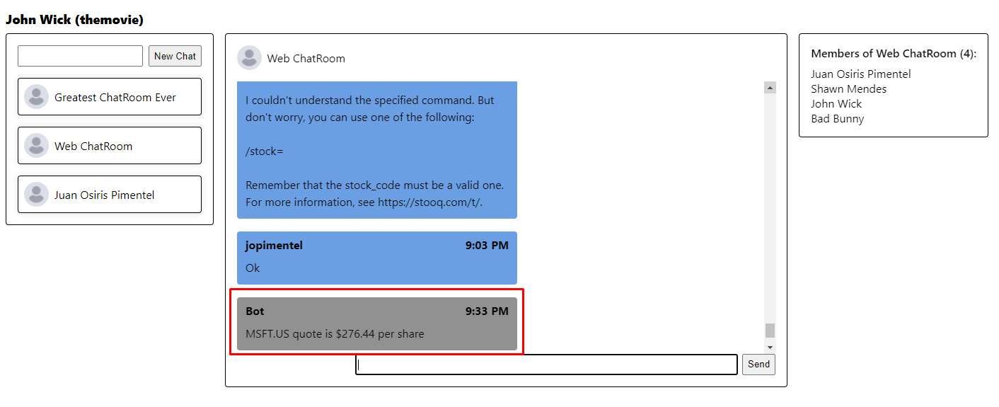
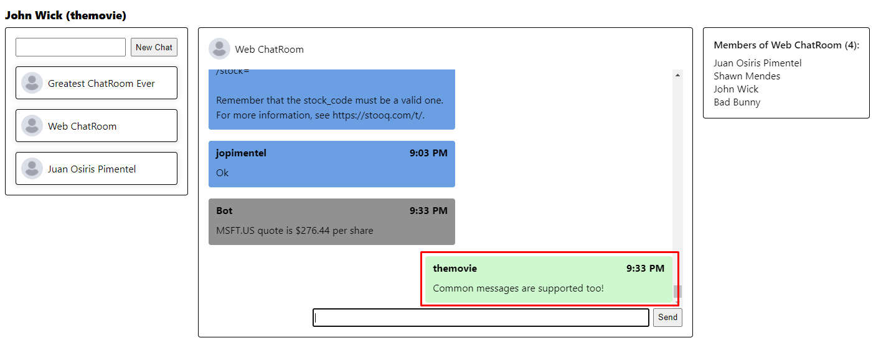
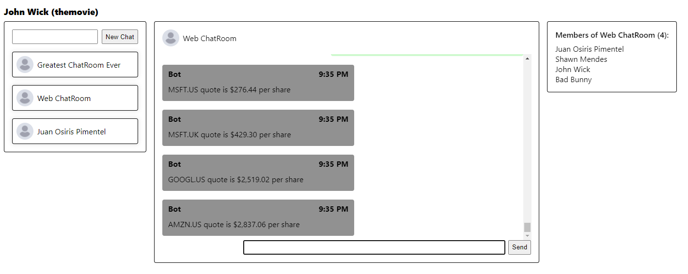

# **dotnet-chatroom** ✉️

A simple 😆 browser-based chat application using .NET. This application:

* Allow several users to talk in a chatroom.
* Allow direct chat between two users..
* Get stock quotes specifying a command: `/stock={stockCode}`. 

## **Content**
- [**dotnet-chatroom** ✉️](#dotnet-chatroom-️)
  - [**Content**](#content)
  - [**Projects**](#projects)
    - [**API & Web Socket**](#api--web-socket)
    - [**Bot**](#bot)
    - [**Angular Application**](#angular-application)
  - [**Features**](#features)
  - [**Technologies**](#technologies)
  - [**How to**](#how-to)
    - [**Run Docker Compose**](#run-docker-compose)
    - [**Run MSSQL Script**](#run-mssql-script)
    - [**Swagger**](#swagger)

## **Projects**

Here I describes the structure of each project. Before starting to read this very long post, lets check the application flow:

In the previous image you could see how the different components work and interact with each other.

### **API & Web Socket**

This project is the responsable of the administration of user, chats and messages. Has an integration (through [RabbitMQ](https://www.rabbitmq.com/)) with the [bot](#bot) component.

The messages are stored in a [MongoDB](https://www.mongodb.com) database. This is because after saving the messages, they won't change and their main use will be for consultation.

Users and Chats are stored in [mssql](https://www.microsoft.com/es-es/sql-server/sql-server-downloads).

### **Bot**

The responsable of getting the stock quote. Receives a command of calls the [stooq api](https://stooq.com/t/) and parses a csv which contain the requested information.

### **Angular Application**

Is a super basic UI and the intention of it existence 🤣 is just to test the functionalities provided by the api and the bot.

## **Features**

* Allows registered users to log in.
* Allows users to talk with other users in a chatroom.
* Allows users to post messages as commands into the chatroom.
  * The format of the commands is: `/stock={stockCode}`
* Decoupled bot that calls an API using the `{stockCode}` as a parameter.
  * The url is https://stooq.com/q/l/?s={stockCode}&f=sd2t2ohlcv&h&e=csv
* The bot parses the received CSV file.
  * It sends a message through RabbitMQ. 
    * The message is formatted as: `MSFT.US quote is $250.42 per share` and posted back into the chat.
    * The post owner will be the bot.
* Chat messages ordered by their timestamps.
* Only show the last 50 messages.
* Handles messages that are not understood or any exceptions raised within the bot.

## **Technologies**

1. [.net6](https://docs.microsoft.com/en-us/dotnet/core/whats-new/dotnet-6)
2. [RabbitMQ](https://www.rabbitmq.com/)
3. [MongoDB](https://www.mongodb.com)
4. [mssql](https://www.microsoft.com/es-es/sql-server/sql-server-downloads)
5. [Docker](https://www.docker.com/)
6. [SignalR](https://dotnet.microsoft.com/en-us/apps/aspnet/signalr)
7. [ASP .NET Web API](https://dotnet.microsoft.com/en-us/apps/aspnet/apis)
9. [XUnit](https://xunit.net/)
10. [Moq](https://github.com/moq/moq4)
11. [NBuilder](https://github.com/nbuilder/nbuilder)
12. [Angular](https://angular.io/)

## **How to**

This section describes put in work the whole components.

### **Run Docker Compose**

To run all the services, I recommend using a script developed as a shortcut to run the `docker compose up` command:

Asumming you cloned the repo...

* Go to the root folder: `..\jobsity`
* Run the following command: `.\tools\docker-compose-up.ps1`
  * This command will run `docker compose up`
  * Will download the following images (if not downloaded yet):
    * mcr.microsoft.com/dotnet/aspnet	
    * mcr.microsoft.com/mssql/server:2019-latest:2019-latest	
    * mongo:latest
    * rabbitmq:management
  * Will create 3 images (one per application).
  * Will create 6 containes:
    * rabbitmq:5672
    * mongodb:27127
    * mssql:1434
    * dotnet.chatroom.api:8081
    * dotnet.chatroom.bot:8082
    * dotnet.chatroom.app:8083

When all services are started, The api and the bot will almost certainly fail due to the long time it takes for RabbtMQ to becomes fully available, so you will need to restart those services. 

**Note**: To verify if RabbitMQ is fully available, go to the [management web site](http://localhost:15672/#/queues).

### **Run MSSQL Script**

Before calling the api and/or using the web app, you must execute a script that creates the database, tables and insert a sample data.

The script is located at: `.\resources\sqlserver\database-creation.sql`

### **Swagger**

The API and the Bot both have swagger in case you need to see the endpoint and its payload. For more information go to [swagger open api](https://swagger.io/tools/open-source/getting-started/).
